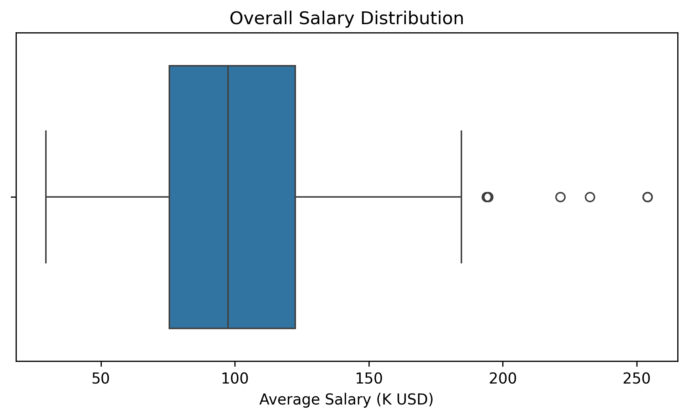

# Tech Salary Analysis (Glassdoor Jobs Dataset)

## Project Overview
This project analyzes salary distributions in the technology job market using a real-world dataset
of Glassdoor job postings. The goal is to demonstrate a complete data analysis workflow:
loading data, cleaning messy fields, performing statistical analysis, and creating clear
visualizations to present insights.

The main focus is on understanding:
- Overall salary distribution and outliers
- How salary distributions vary across industries
- Whether company rating shows any relationship with salary levels

---

## Dataset
- *Source:* Kaggle (Glassdoor job listings dataset)
- *File used:* glassdoor_jobs.csv
- *Type:* Downloaded, messy real-world CSV

The dataset includes (among others) the following attributes:
- Job Title
- Salary Estimate (stored as string ranges, e.g., $53K-$91K)
- Company Rating
- Industry
- Company Size, Revenue, Sector, Location, etc.

---
## Data Cleaning (Step-by-step)
The downloaded dataset contains messy and inconsistent values. The following preprocessing steps
were applied before analysis:

### 1) Remove irrelevant columns
Some datasets include an extra index-like column (e.g., Unnamed: 0).  
This column is removed because it does not contribute to analysis.

### 2) Filter invalid salary entries
Salary information may include placeholder values (e.g., -1) or missing entries.
These rows are removed to avoid corrupting statistical analysis.

### 3) Convert salary ranges to numerical values
The Salary Estimate column is originally stored as text ranges such as:
- $53K-$91K (Glassdoor est.)

To perform analysis, salaries are converted into:
- *MinSalary* (minimum of the range)
- *MaxSalary* (maximum of the range)
- *AvgSalary* (mean of min and max)

This enables summary statistics, quartiles, and boxplots.

### 4) Handle missing values in key columns
Rows with missing values in critical analysis columns (e.g., AvgSalary, Rating)
are removed to ensure calculations and plots are valid.

---
## Data Analysis
The analysis includes both baseline and advanced statistical methods:

### Baseline summary statistics
- Mean
- Median
- Minimum / Maximum
- Standard descriptive statistics via `describe()`

### Advanced analysis
- Quartiles (Q1, Q2/median, Q3)
- Interquartile Range (IQR)
- Box-and-whisker interpretation for identifying outliers

Why quartiles/IQR matter here:  
Salary distributions are often skewed and contain extreme values; therefore, median and IQR
provide more robust insights than mean alone.

## Visualizations
Visualizations were used to support statistical findings and make salary distribution patterns
and outliers easier to interpret.

The following plots were produced using *Matplotlib* and *Seaborn*.

### 1) Overall Salary Distribution (Boxplot)
This plot summarizes the overall salary distribution, highlighting:
- Median salary
- IQR (middle 50% range)
- Outliers (unusually high salaries)

